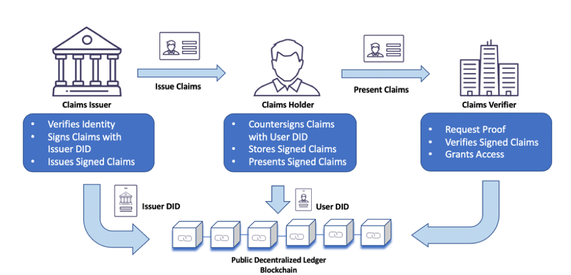

# Simple-SSI

- ref : https://www.idaptive.com/blog/self-sovereign-identity-distant-dream-immediate-possibility/

## This project implements and tests the basic elements of SSI

- VC(Verifiable Credential) : verifiable credential document
- VP(Verifiable Presentaion) : Verifiable Credential Data Set - Newly configured Credential documentation that extracts data from multiple VCs issued by Holder
- Holder : End users who want to use the Self-Sovereign Identification Service using the DID platform
- Issuer : An institution that issues VCs at Holder's request by referring to DID doc registered in the distributed ledger (or blockchain)
- Verifier : Qualifier to validate VC, VP

## example GIF

## To Start

- run ./actors/vdr/resolver/server/resolver.go
- run ./actors/vdr/registrar/server/registrar.go
- run ./actors/startDaemon/verifierDaemon/verifierd.go
- run ./actors/startDaemon/issuerDaemon/issuerd.go
- run ./actors/startDaemon/holderDaemon/holderd.go

## To get more information, check example2.mp4 out
